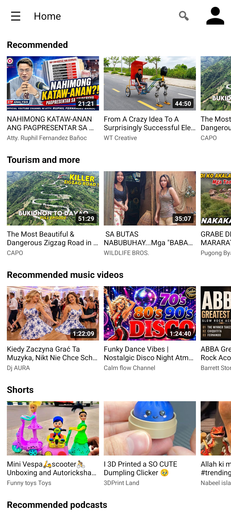
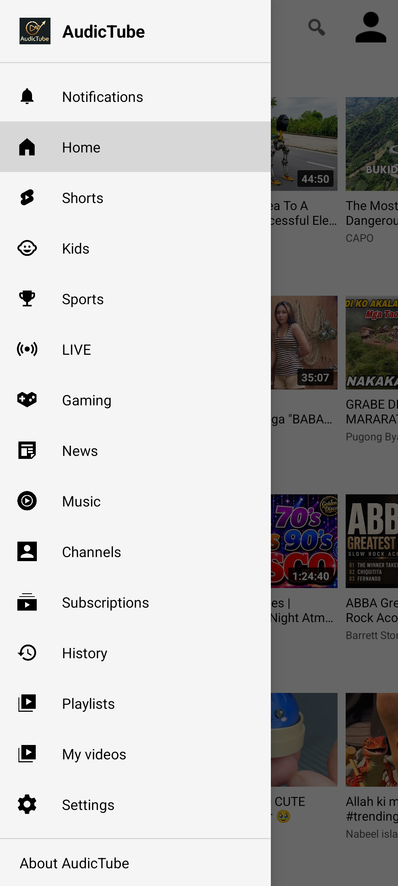

# 🎵 AudicTube

**A phone and tablet YouTube client for Android.**  

AudicTube is a fork of [CodeSculptor/SmarterTube](https://github.com/CodeSculptor/SmarterTube) (which is itself a fork of [yuliskov/SmartTube](https://github.com/yuliskov/SmartTube) — an Android TV YouTube client). The upstream SmartTube is **TV-only** by design; SmarterTube added a native phone/tablet interface on top of its engine. AudicTube builds on that work with further mobile-first enhancements, refinements, and a fresh identity.

**AudicTube is not a patched YouTube APK and not a wrapper** — it is a native Android app built on SmartTube's YouTube client engine.

<p align="center">
  
  &nbsp;&nbsp;&nbsp;
  
  &nbsp;&nbsp;&nbsp;
  
</p>

<p align="center">
  
</p>

---

## ✨ What's New in AudicTube

This fork adds several mobile-first enhancements on top of SmarterTube's foundation:

| Feature | Description |
|---------|-------------|
| **🎨 Fresh branding** | Renamed to AudicTube with new logo, app icon, and in-app branding |
| **📱 16KB page alignment** | Native libraries fixed for Android 15+ compatibility — no more "app not compatible" warnings |
| **🔄 Semantic versioning** | Version scheme simplified to pure semver (`v1.0.0`, `v1.1.0-beta.1`) following [conventionalcommits.org](https://www.conventionalcommits.org/en/v1.0.0/) |
| **🖼️ Fullscreen toggle** | New button in the player controls to switch between portrait strip and landscape fullscreen — no need to physically rotate your device |
| **📦 In-app update checker** | Built-in update checker that queries GitHub releases, respects release channels (alpha/beta/stable), and downloads the right APK for your device's ABI |
| **🤖 Automated GitHub builds** | CI workflow that builds signed release APKs on tag push or manual trigger, generates changelogs, and publishes GitHub Releases automatically |
| **🔧 Background & fixes** | Various stability improvements, crash fixes, and mobile UX refinements |
---

## Relationship to Upstream

```
yuliskov/SmartTube (Android TV)
       └── CodeSculptor/SmarterTube (adds phone/tablet UI)
                └── playpixelpro/AudicTube (mobile-first enhancements)
```

- **[yuliskov/SmartTube](https://github.com/yuliskov/SmartTube)** — the original Android TV YouTube client. The playback engine, ad blocking, SponsorBlock, Return YouTube Dislike, DeArrow, and all InnerTube API code come from upstream, merged unchanged on every release.
- **[CodeSculptor/SmarterTube](https://github.com/CodeSculptor/SmarterTube)** — the first fork to add a native phone/tablet UI (portrait mode, drawer navigation, touch-friendly controls) on top of SmartTube's engine.
- **AudicTube** — continues that work with further mobile refinements, a fresh identity, automated builds, and modern Android compatibility fixes.

> **A huge thank you to [CodeSculptor](https://github.com/CodeSculptor) for SmarterTube** — the phone/tablet foundation this fork builds on would not exist without their work. And thank you to [yuliskov](https://github.com/yuliskov) for SmartTube, the original YouTube client engine that makes all of this possible.

---

## Versioning

AudicTube follows **pure semantic versioning** (SemVer 2.0):

```
v1.0.0
v1.1.0-beta.1
v2.0.0
```

| Format | Example | Meaning |
|--------|---------|---------|
| `v1.0.0` | `v1.0.0` | Stable release |
| `v1.1.0-beta.1` | `v1.1.0-beta.1` | Beta pre-release |
| `v1.0.0-rc.1` | `v1.0.0-rc.1` | Release candidate |

APK assets follow the naming pattern: `AudicTube-v1.0.0-arm64-v8a.apk`

---

## 📱 What works

### Phone UI (this fork adds)
- Portrait home screen with drawer navigation (Home, Shorts, Kids, Sports, LIVE, Gaming, News, Music, Channels, Subscriptions, History, Playlists, My videos)
- Search with suggestions and results grid, plus voice search
- Channel pages and channel uploads
- Portrait settings screen
- Sign in / sign out — OAuth device-code flow via in-app browser tab
- About screen with **in-app update checker**
- **Fullscreen toggle button** in player controls
- **Picture-in-Picture (PiP)** — enabled by default when pressing Back or Home
- PiP / background audio / playback settings

### From upstream (YouTube client engine, unchanged)
- SponsorBlock integration
- Return YouTube Dislike
- DeArrow
- Adjustable playback speed
- Up to 8K / 60fps / HDR
- No Google Play Services required
- No ads

---

## ⬇️ Download

[**GitHub Releases →**](https://github.com/playpixelpro/AudicTube/releases)

Pick the APK for your device:

| ABI | Who needs it |
|:---|---|
| `arm64-v8a` | Most Android phones made after 2016 |
| `armeabi-v7a` | Older 32-bit devices |
| `x86` | Emulators |
| `universal` | Everything — larger file |

AudicTube installs as `com.playpixelpro.audictube` and is **co-installable** with the upstream SmartTube TV build (`app.smarttube`). They do not conflict.

### Auto-updates via Obtainium

1. Install [Obtainium](https://obtainium.imranr.dev/)
2. **Add App** → paste `https://github.com/playpixelpro/AudicTube`
3. Obtainium tracks each new release automatically; choose the `arm64-v8a` asset (or `universal`) when prompted.

This is the easiest way to stay current.

### Verifying your download

Every APK on the Releases page carries a **SHA-256 digest**. After downloading, compare it against the file on your device:

```bash
# Linux/macOS
sha256sum AudicTube-*.apk
# Windows (PowerShell)
Get-FileHash AudicTube-*.apk -Algorithm SHA256
```

If the hash matches the one GitHub shows for that asset, the file is intact.

---

## ⚠️ Known limitations

- **Not all upstream features are surfaced yet** — the phone UI covers the core journey (Home, Search, Channel, Settings, sign-in, playback); some upstream options remain reachable only through the settings screens, and a few aren't wired into the phone UI at all.
- **YouTube API breakage** — YouTube changes its private APIs without warning, which can break playback at any time. Fixes depend on upstream SmartTube's cadence, then a merge here.
- **Sideload only** — not on any app store. Install the APK yourself from Releases, or use [Obtainium](#auto-updates-via-obtainium) to install and auto-update directly from GitHub.
- **No guarantees** — this is an independent fork with no affiliation to Google/YouTube or to upstream authors.

Specific gaps:

- **TV / leanback interface** — install [upstream SmartTube](https://github.com/yuliskov/SmartTube) for Android TV boxes and sticks.
- **Casting / Chromecast** — not currently exposed in the phone UI.

---

## 🔧 Building

Requires JDK 17 and Android SDK.

```bash
# Debug (phone build)
./gradlew :smarttubetv:assembleStmobileDebug

# Release (needs keystore.properties + key.jks at repo root)
./gradlew :smarttubetv:assembleStmobileRelease
```

Output APKs land in `smarttubetv/build/outputs/apk/stmobile/`.

### Automated builds
Push a tag matching `v*` to trigger the CI workflow, which builds, signs, and publishes a GitHub Release automatically:

```bash
git tag v1.0.0
git push --tags
```

All phone-specific code lives under `smarttubetv/src/stmobile/` — no changes to `src/main` (TV code) except bug fixes that benefit both targets, which are submitted upstream.

---

## 🙏 Credits

- **[yuliskov](https://github.com/yuliskov)** — creator of [SmartTube](https://github.com/yuliskov/SmartTube), the original Android TV YouTube client that powers this app
- **[CodeSculptor](https://github.com/CodeSculptor)** — creator of [SmarterTube](https://github.com/CodeSculptor/SmarterTube), the phone/tablet fork this project builds upon
- All upstream contributors whose work makes this possible

---

## ☕ Support

If you enjoy using AudicTube, consider supporting the project! Your contributions help keep development active and bring new features to life.

<p align="center">
  <a href="https://ko-fi.com/playpixelpro">
    
  </a>
  &nbsp;&nbsp;
  <a href="https://buymeacoffee.com/playpixelpro">
    
  </a>
</p>

<p align="center">
  <sub>Every bit of support means the world — thank you! 🙏</sub>
</p>

---

## 📄 License

Licensed under [MIT](LICENSE), same as upstream.

---

## 🔒 Privacy

See [PRIVACY.md](PRIVACY.md).
